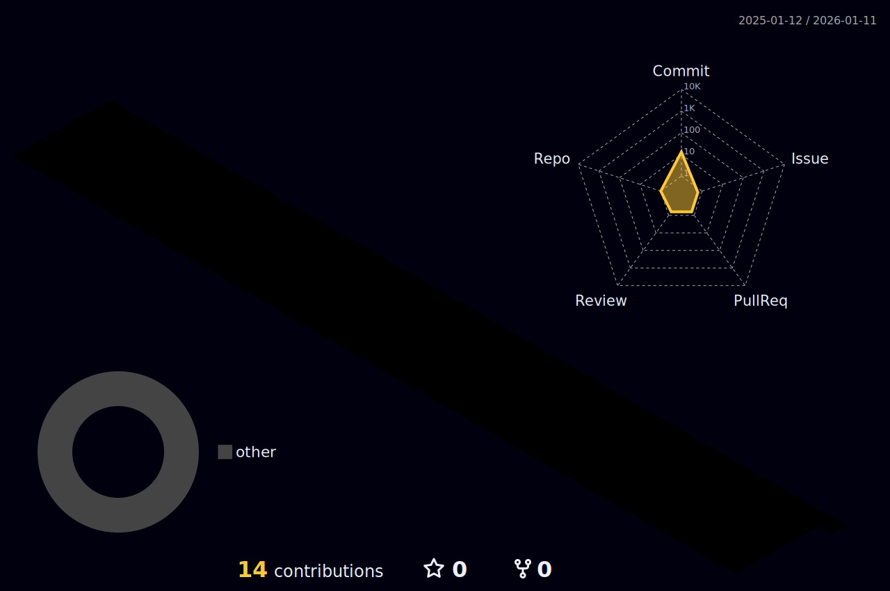

  

  

  

  
  
  
  

 

---

  

  <h2> About Me</h2>
  
  

    🚀 <b>High-Performance Backend Engineer.</b> 
    Tôi tập trung xây dựng các hệ thống có khả năng mở rộng, độ trễ thấp và kiến trúc bền vững.  
    ⚙️ <b>Core Stack:</b>
    <ul>
        <li><b>C++ & C#:</b> Tối ưu hóa bộ nhớ, đa luồng (multithreading).</li>
        <li><b>SQL Sever</b> Cơ sở dữ diệu và quản lý dữ liệu</li>
        <li><b>Web Tech:</b> HTML5, CSS3, JS cho tools hỗ trợ.</li>
    </ul>
    🔭 <b>Mục tiêu:</b> Đẩy giới hạn phần cứng, tạo code sạch và hiệu quả. 
    <i>"Optimization is not just a task, it's a mindset."</i>
  

 

---

##  Skills & Technologies

  
  ### ⚡ Backend & Game Dev
  

    
    
    
    
    
  
  ### 🌐 Web & Tools
  

    
    
    
    
    
  

---

<h2 align="center">🌆 Cyber City Map</h2>

  

 

<h2 align="center">🐍 Fire Snake</h2>

  <picture>
    <source media="(prefers-color-scheme: light)" srcset="https://raw.githubusercontent.com/HYowshi/HYowshi/output/github-contribution-grid-snake.svg" />
    <source media="(prefers-color-scheme: dark)" srcset="https://raw.githubusercontent.com/HYowshi/HYowshi/output/github-contribution-grid-snake-orange.svg" />
    
  </picture>

---

    
  

    

      © 2025 Lăng_Hạ | ⚡ Building the Future
    

  

